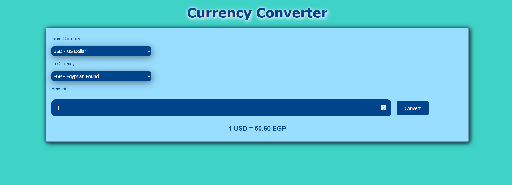

Here's a README for your currency converter project:

---

# 💱 Currency Converter

A simple and user-friendly **Currency Converter** web application built with **HTML, CSS, and JavaScript**. This tool allows users to convert between different currencies with real-time exchange rates.

## 📌 Features
- Convert between multiple currencies.
- User-friendly **dropdown selections** for currency choice.
- **Live exchange rates** display.
- **Styled UI** with smooth design and color themes.
- **Fully responsive** for all screen sizes.

## 🛠️ Tech Stack
- **HTML** – Structure of the webpage.
- **CSS** – Styling and layout.
- **JavaScript** – Logic for currency conversion and interactivity.

## 📸 Screenshot


## 🚀 How to Use
1. **Select the currency** you want to convert from.
2. **Choose the currency** you want to convert to.
3. **Enter the amount** you wish to convert.
4. Click the **"Convert"** button to get the result.

## 📂 Setup Instructions
1. Clone the repository:
   ```bash
   git clone https://github.com/yourusername/currency-converter.git
   ```
2. Navigate to the project directory:
   ```bash
   cd currency-converter
   ```
3. Open `index.html` in a browser.

## 📬 Contact
For any suggestions or improvements, feel free to reach out at **ahmedmlotfi@outlook.com**.

---
Made with ❤️ by **Ahmed Lotfi**

Let me know if you want any modifications! 🚀
